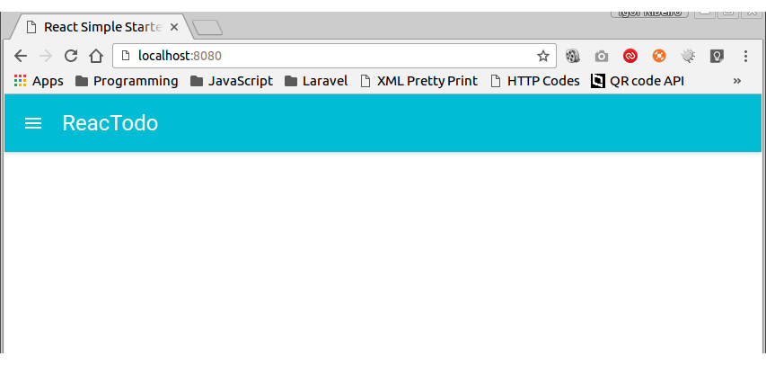
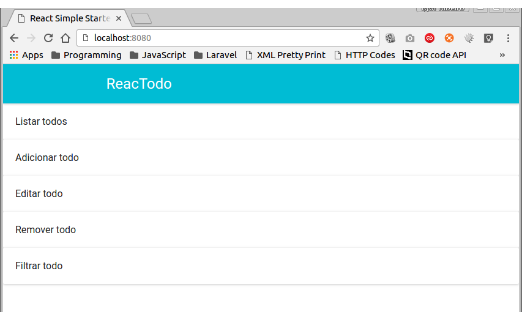

# Tutorial de React

Vamos fazer um TodoApp usando React virgem. Como o escopo do curso é apenas React, já deixei uma estrutura pronta pra focarmos apenas nele.

# Sumário
- [Instalação e configuração inicial](#instalação-e-configuração-inicial)
- [React](#react)
- [Por que React?](#por-que-react)
  - [One-way-data-binding](#one-way-data-binding)
  - [Virtual DOM](#virtual-dom)
- [Pondo a mão na massa](#pondo-a-mão-na-massa)
- [Pondo a mão na massa pra valer](#pondo-a-mão-na-massa-pra-valer)
  - [Material UI](#material-ui)
  - [AppBar](#appbar)
  - [Estilo no Javascript](#estilo-no-javascript)
  - [Listar todos](#listar-todos)
  - [Separando os componentes](#separando-os-componentes)
    - [Separando AppBar](#separando-appbar)
    - [Separando todos](#separando-todos)
  - [Manipulando estado](#manipulando-estado)
  - [Removendo todo](#removendo-todo)

## Instalação e configuração inicial
Clone o repositório ```git@github.com:igor-ribeiro/react-simple-starter.git NOME_DA_PASTA```.

Entre na pasta do app.

Remova a origem do repositório ```git remote remove origin``` e adicione um seu ```git remote add origin git@github.com/USUARIO/REPOSITORIO```

Instale as dependências ```npm install```

Instale globalmente o webpack e webpack-dev-server ``` npm i -g webpack webpack-dev-server```

Inicie o servidor ```webpack-dev-server --content-base public/ --inline```. Acesse o projeto em ```http://localhost:8080/``` e você verá no console ```just react it!```. Pronto, podemos começar.

O projeto final pode ser encontrado em: ```https://github.com/igor-ribeiro/reactodo```

## React

Segundo o [site oficial](https://facebook.github.io/react/), React é uma biblioteca para a criação de interfaces de usuário, ou seja, seria a View do MVC. React é declarivo, baseado em componente e uma biblioteca livre, possibilitando a criação de novas funcionalidades usando React sem afetar o código existente.

Apesar desse slogan ```A JAVASCRIPT LIBRARY FOR BUILDING USER INTERFACES```, você consegue criar aplicações completas em React, como nós faremos como nosso TodoApp, carinhosamente chamado de ReacTodo.

**Usaremos ES6 :D**

## Por que React?

### One-way-data-binding

Se você já usou AngularJS sabe que o estado da aplicação pode ser alterado de duas maneiras, na view e no controller, o famoso ```two-way-data-binding```. Mas os engenheiros do Facebook não acreditam que essa seja a melhor maneira, pois o seu estado fica muito 'solto', elem acreditam que o estado deve ser modificado no menor número de lugares possível.

Então, no React, você sempre precisará alterar o estado de forma declarativa através da função ```setState```. Não se preocupe, veremos isso mais pra frente.

### Virtual DOM

O React é rápido porque cria uma representação da DOM em memória, e é nessa representação que ele vai calcular as diferenças para decidir se um componente precisa ser atualizado ou não. Ele faz isso para diminuir o número de operações na DOM, pois isso é um trabalho custoso. Outras bibliotecas estão adotando isso, inclusive AngularJS na versão 2 ;).

## Pondo a mão na massa

Vamos começar adicionando React na nossa página. Abra o arquivo ```src/app.js```. Ele deve ser parecido com:

```js
'use strict';

console.log('just react it!');
```
Apague a linha do ```console.log``` e me acompanhe.

Vamos começar importando o React e ReactDOM.

```js
import React from 'react';
import ReactDOM from 'react-dom';
```

ReactDOM é o cara responsável por adicionar nosso componente na DOM (logo veremos isso).

Vamos criar um super componente que imprime um título 'Hello, React!'.

```js
class HelloComponent extends React.Component {
  render() {
    return <h1>Hello, React!</h1>;
  }
}
```

**PARA TUDO, QUE M&%$ É ESSA??**

Não, você não está louco, fizemos isso mesmo. Nosso HTML agora faz parte do JS.
Mas pode isso, Arnaldo? Pode sim, graças ao JSX. Você não precisa escrever React dessa maneira, mas para de ser chato!

Se você acessar a página não vai ver nada, é aí que entra o nosso amigo ReactDOM. Bora renderizar nosso componente massa!

```js
ReactDOM.render(<HelloComponent />, document.getElementById('app'));
```

Agora você deve ver 'Hello, React!' na página.

Viu? Ótimo, agora vamos entender umas paradas.

Notaram que o nossa classe se tornou um 'elemento' HTML? A ideia do React é essa, nós vamos criar componentes e usá-los como se fossem elementos HTML.

Legal, mas e isso ```document.getElementById('app')```? Aqui nós falamos para o React onde ele deve renderizar nosso componente. Se você abrir o arquivo ```src/index.html``` vai ver que lá existe ```<div id="app">```, então é dentro desse cara que nosso componente será renderizado.

Está duvidando? Abra a inspeção de elementos do seu navegador, vai ver que dentro da div existe o conteúdo do nosso componente, algo parecido com ```<h1 data-reactroot>Hello, React!</h1>```

Entendeu o porquê do React não atrapalhar código existente no seu projeto? Basta dizer em qual elemento seu novo componente estará e pronto. It works :D

## Pondo a mão na massa pra valer

Ótimo, agora você já é quase um sênior em React :P. Então vamos começar nosso TodoApp de verdade, e no caminho vamos entendendo algumas paradas novas.

### Material UI

Como nós somos cool, vamos usar Material Design, então instale os seguinte pacotes:

```npm i --save react-tap-event-plugin material-ui```

Nãoo se esquece de importar a fonte Roboto no arquivo ```src/index.html```

```html
<link rel="stylesheet" href="https://fonts.googleapis.com/css?family=Roboto:400,300,100,500,700,900">
```

Todos os componentes que formos usar do ```material-ui``` devem ficar dentro do componente ```MuiThemeProvider```. Para testarmos a intalação do material-ui, altere o ```app.js``` para ficar assim:

```js
'use strict';

import React from 'react';
import ReactDOM from 'react-dom';

import MuiThemeProvider from 'material-ui/styles/MuiThemeProvider';
import RaisedButton from 'material-ui/RaisedButton';

class HelloComponent extends React.Component {
  render() {
    return (
      <MuiThemeProvider>
        <RaisedButton label="Funcionoooooooou"/>
      </MuiThemeProvider>
    );
  }
}

ReactDOM.render(<HelloComponent />, document.getElementById('app'));
```

Viu que bonito o botão? :B

[Documentação do Material UI](http://www.material-ui.com/)

**Psiu**

Remova o ```margin``` e ```padding``` do ```body``` em ```src/index.html```:
```html
<style>
  body {
    margin: 0;
    padding: 0;
  }
</style>
```

### AppBar

Vamos 'começar' criando um AppBar.

Deixa o ```app.js``` assim:

```js
'use strict';

import React from 'react';
import ReactDOM from 'react-dom';

import MuiThemeProvider from 'material-ui/styles/MuiThemeProvider';

class ReacTodo extends React.Component {
  render() {
    return (
      <MuiThemeProvider>
      </MuiThemeProvider>
    );
  }
}

ReactDOM.render(<ReacTodo />, document.getElementById('app'));
```

Vamos importar o componente ```AppBar```

```js
import AppBar from 'material-ui/AppBar';
```

Agora é só adicionar no nosso componente principal.

```js
return (
  <MuiThemeProvider>
    <AppBar title="ReacTodo"/>
  </MuiThemeProvider>
);
```

Saca só que maaaaaaassa!


Mas não vamos precisar do ícone do menu, bora resolver isso?
```js
<AppBar title="ReacTodo" showMenuIconButton={false}/>
```


Mas Igor, por que não definimos falso igual no HTML? ```showMenuIconButton="false"```? Muito bem, meu jovem. Porque dessa forma o React entenderia ```false``` como um texto e não um valor booleano. Boa pergunta! ;)

Mas Igor, e se eu quiser deixar assim?


Caraca muleque, cheio das perguntaas boladas, ein? Vamos ver essa fita então.

### Estilo no Javascript

Seguinte, mesmo com React você ainda pode usar CSS. Basta  adicionar uma classe para o seu componente.

**CUIDADO!**

Como ```class``` é uma palavra reservada do Javascript você deve definir classes de CSS usando ```className```. Isso serve para ```for``` também, você usa em React como ```htmlFor```. (Padrão zero, mas OK).

Mas hoje vou ensinar de outra maneira, que você talvez odeiem. Vamos declarar o CSS no Javascript, em forma de objeto. Siga-me.

Vamos definir uma váriavel que vai conter nossos estilos.

```js
const styles = {
  appBar: {
    padding: '0 20%',
  },
};
```

Agora vamos adicionar no nosso AppBar maroto.

```js
<AppBar title="ReacTodo" showMenuIconButton={false} style={styles.appBar}/>
```

Obrigado, de nada.

As propriedades de CSS possuem o mesmo nome, porém em camelCase, por exemplo ```background-color``` fica ```backgroundColor```.

Para valores únicos em ```px``` use inteiros, por exemplo ```width: 100px;``` fica ```width: 100```, ```font-size: 30px;``` fica ```fontSize: 30```. Caso o valor não seja único, coloque numa string, por exemplo ```margin: 20px 40px``` fica ```margin: '20px 40px'```.

[Documentação](https://facebook.github.io/react/tips/inline-styles.html).

### Listar todos

Por enquanto vamos criar uma lista com os todos dentro do método render.

```js
render() {
    const todos = ['Listar todos', 'Adicionar todo', 'Editar todo', 'Remover todo', 'Filtrar todo'];

    // continuação do método
}
```

Vamos usar o elemento Paper para os todos, então devemos importá-lo.

```js
import Paper from 'material-ui/Paper';
```

Abaixo do AppBar, faça o seguinte:
```js
{todos.map((todo) => { return <Paper>{todo}</Paper>; })}
```

Igor, WTH????

É, eu sei. Vou explicar.

Se você já trabalhou com AngularJS sabe que devemos usar ```{{}}``` pra expressões, certo? Em React usamos ```{}```.

```todos.map((todo) => { ... })``` isso aqui é ES6, bro! Chamamos de Arrow Functions, é uma nova maneira de declarar uma função, o equivalente ao ES5 seria ```todos.map(function (todo) { ... })```. Começou a entender né?! Vai flagrando.

```js
return <Paper>{todo}</Paper>;
```

Para cada todo na lista, nós retornaremos um elemento Paper com o valor do todo.

> Mas Igor, usando Arrow Function você não precisa declarar o ```return``` caso retorne apenas uma linha.

Isso é verdade, meu jovem. Porém, como o React usa ```{}``` pra interpolação, nosso compilador não vai entender se esse símbolo é para o bloco de return ou para o React, sacou?

Aproveitando, perceberam que não coloquei o elemento Paper entre parênteses, diferente do return no método render? Pois é, você só precisa colocar entre parênteses quando for retornar mais de uma linha.

Provavelmente você notou que deu erro, algo assim:

```
Warning: Failed propType: Invalid prop 'children' supplied to 'MuiThemeProvider', expected a single ReactElement. Check the render method of 'ReacTodo'.warning @ app.js:8583

Uncaught Invariant Violation: MuiThemeProvider.render(): A valid React element (or null) must be returned. You may have returned undefined, an array or some other invalid object.
```

O elemento ```MuiThemeProvider``` só pode ter um filho, e no nosso caso, não tem. Vamos dar uma olhada return:
```js
return (
  <MuiThemeProvider>
      <AppBar title="ReacTodo" showMenuIconButton={false} titleStyle={styles.appBarTitle} style={styles.appBar}/>
      {todos.map((todo) => { return <Paper>{todo}</Paper>; })}
  </MuiThemeProvider>
);
```

Isso se transformará em:

```jsx
  <MuiThemeProvider>
      <AppBar title="ReacTodo" showMenuIconButton={false} titleStyle={styles.appBarTitle} style={styles.appBar}/>
      <Paper>Listar todos</Paper>
      <Paper>Adicionar todo</Paper>
      <Paper>Editar todo</Paper>
      <Paper>Remover todo</Paper>
      <Paper>Filtrar todo</Paper>
  </MuiThemeProvider>
```

Ou seja, o elemento ```MuiThemeProvider```  tem 6 filhos! Quase um Mr. Catra. Para resolver isso basta colocar todo mundo dentro de uma ```div```

```jsx
  <MuiThemeProvider>
    <div>
      <AppBar title="ReacTodo" showMenuIconButton={false} titleStyle={styles.appBarTitle} style={styles.appBar}/>
      {todos.map((todo) => { return <Paper>{todo}</Paper>; })}
    </div>
  </MuiThemeProvider>
```

Entendeu?

Mas você deve ter reparado em outro erro:
```
Warning: Each child in an array or iterator should have a unique "key" prop. Check the render method of 'ReacTodo'. See https://fb.me/react-warning-keys for more information.
```

Como estamos renderizando cada todo dentro de um loop, precisamos passar algum identificador único para cada elemento. Isso garante que o React faça as paradas certas nos elementos certos.

```js
{todos.map((todo, key) => { return <Paper key={key}>{todo}</Paper>; })}
```

Pronto, o segundo parâmetro de map é o index do item na lista, ou seja, o index do primeiro item será 0, do segundo será 1 e assim por diante.

AGORA VAI. Nosso app deve estar assim:


FEIO PRA XUXU!

Bora adicionar uns estilos.

Adicione isso na variável de estilos:
```js
  todo: {
    padding: 20,
  },
```

E adicione o estilo no elemento.

```jsx
{todos.map((todo, key) => { return <Paper style={styles.todo} key={key}>{todo}</Paper>; })}
```



Melhorou, mas nem tanto. Vamos alinhar os todos assim como fizemos no AppBar. Para isso, a listagem de todos deve ficar dentro de uma div.

```jsx
<div style={styles.mainContent}>
  {todos.map((todo, key) => { return <Paper style={styles.todo} key={key}>{todo}</Paper>; })}
</div>
```

Vamos criar o estilo do mainContent
```js
mainContent: {
  padding: '20px 20%',
},
```


MAGNÍFICO.

Fizemos coisa pra caramba, então segue nosso arquivo ```src/app.js```

```js
'use strict';

import React from 'react';
import ReactDOM from 'react-dom';

import MuiThemeProvider from 'material-ui/styles/MuiThemeProvider';
import AppBar from 'material-ui/AppBar';
import Paper from 'material-ui/Paper';

class ReacTodo extends React.Component {
  render() {
    const todos = ['Listar todos', 'Adicionar todo', 'Editar todo', 'Remover todo', 'Filtrar todo'];

    return (
      <MuiThemeProvider>
        <div>
          <AppBar title="ReacTodo" showMenuIconButton={false} style={styles.appBar}/>

          <div style={styles.mainContent}>
            {todos.map((todo, key) => { return <Paper style={styles.todo} key={key}>{todo}</Paper>; })}
          </div>
        </div>
      </MuiThemeProvider>
    );
  }
}

const styles = {
  appBar: {
    padding: '0 20%',
  },

  todo: {
    padding: 20,
  },

  mainContent: {
    padding: '20px 20%',
  },
};

ReactDOM.render(<ReacTodo />, document.getElementById('app'));
```

Convenhamos que já está ficando bagunçado né? Bora separar isso?

### Separando os componentes

#### Separando AppBar

A gente nem fez tanta coisa assim, mas já está ficando confuso.

Vamos começar seprando o AppBar.

Crie o arquivo ```src/components/common/app-bar.js```
```js
'use strict';

import React from 'react';

import AppBar from 'material-ui/AppBar';

export default () => {
  return <AppBar title="ReacTodo" showMenuIconButton={false} style={styles.appBar}/>
}

const styles = {
  appBar: {
    padding: '0 20%',
  },
};
```

```export default () => {``` é o mesmo que ```module.exports = function () {```.

Nosso ```app.js``` vai ficar assim:
```js
'use strict';

import React from 'react';
import ReactDOM from 'react-dom';

import MuiThemeProvider from 'material-ui/styles/MuiThemeProvider';
import Paper from 'material-ui/Paper';

import AppBar from './components/common/app-bar';

class ReacTodo extends React.Component {
  render() {
    const todos = ['Listar todos', 'Adicionar todo', 'Editar todo', 'Remover todo', 'Filtrar todo'];

    return (
      <MuiThemeProvider>
        <div>
          <AppBar />

          <div style={styles.mainContent}>
            {todos.map((todo, key) => { return <Paper style={styles.todo} key={key}>{todo}</Paper>; })}
          </div>
        </div>
      </MuiThemeProvider>
    );
  }
}

const styles = {
  todo: {
    padding: 20,
  },

  mainContent: {
    padding: '20px 20%',
  },
};

ReactDOM.render(<ReacTodo />, document.getElementById('app'));
```

Espera aí, vai funcionar? Não estamos criando uma classe AppBar e extendendo de ```React.Component```.

E agora você aprende outro conceito bacana.

**Stateless Component**

Como nosso AppBar não vai manusear estado nenhum, não será um componente dinâmico, ele não precisa de nada além de retornar um componente. Mais pra frente veremos que os componentes do React possuem um ciclo de vida e com isso teremos alguns métodos a nossa disposição para interafir com esse ciclo, porém para componentes simples, como nosso AppBar, esse ciclo é irrelevante. Então podemos usar funções que retornem um componente. Simples assim. Na verdade nós já fizemos isso, dê uma olhada em como renderizamos cada todo. ;)

E se quisermos deixar o AppBar mais reusável, permitindo alterar o título, por exemplo.

Façamos o seguinte em ```app-bar.js```
```js
export default (props) => {
  return <AppBar title={props.title || 'App Title'} showMenuIconButton={false} style={styles.appBar}/>
}
```

Vamos receber ```props``` como parâmetro e em title nós vamos mostrar o título que vier em props ou vamos mostrar "App title" por padrão. E como passamos o título? Vá em ```app.js``` e passe o título como se fosse um atributo HTML para AppBar
```jsx
<AppBar title="ReacTodo"/>
```

Pronto, agora você aprendeu a passar parâmetros para componentes. \o/

#### Separando todos

Na mesma pegada do AppBar, vamos mover a parte de listar os todos para um componente separado.

Crie o arquivo ```src/components/todos/todos-list.js```
```js
'use strict';

import React from 'react';

import Paper from 'material-ui/Paper';

export default (props) => {
  return (
      <div style={styles.mainContent}>
        {props.todos.map((todo, key) => { return <Paper style={styles.todo} key={key}>{todo}</Paper>; })}
      </div>
  );
};

const styles = {
  todo: {
    padding: 20,
  },

  mainContent: {
    padding: '20px 20%',
  },
};
```

Importe o componente
```js
import TodosList from './components/todos/todos-list';
```

E substitua a parte que renderizava os todos em ```app.js```

```jsx
// Antes
<div style={styles.mainContent}>
  {todos.map((todo, key) => { return <Paper style={styles.todo} key={key}>{todo}</Paper>; })}
</div>

// Depois
<TodosList todos={todos}/>
```

Agora nosso ```app.js``` completo ficou assim
```js
'use strict';

import React from 'react';
import ReactDOM from 'react-dom';

import MuiThemeProvider from 'material-ui/styles/MuiThemeProvider';

import AppBar from './components/common/app-bar';
import TodosList from './components/todos/todos-list';

class ReacTodo extends React.Component {
  render() {
    const todos = ['Listar todos', 'Adicionar todo', 'Editar todo', 'Remover todo', 'Filtrar todo'];

    return (
      <MuiThemeProvider>
        <div>
          <AppBar title="ReacTodo"/>

          <TodosList todos={todos}/>
        </div>
      </MuiThemeProvider>
    );
  };
}

ReactDOM.render(<ReacTodo />, document.getElementById('app'));
```

Bem melhor né? Agora vamos deixar nosso app dinâmico manipulando o estado do nosso componente. Aguenta firme.

### Manipulando estado

Antes, vamos importar o lodash, se você não conhece, [conheça](https://lodash.com/docs).

```npm i --save lodash```

Depois importe ```import _ from 'lodash'```

Vamos remover a variável todos do método render e vamos adicionar no estado da nosso componente. Estado em React pode ser considerado o equivalente ao $scope no Angular.

Para isso precisamos chamar o método ```contructor``` que faz parte da especificação ES6 para classes.

```js
class ReacTodo extends React.Component {
  constructor(props) {
    super(props);

    this.state = {
      todos: ['Listar todos', 'Adicionar todo', 'Editar todo', 'Remover todo', 'Filtrar todo'],
    };
  }
```

Por que ```super(props)```? Porque não podemos usar o this sem chamar o construtor da classe que estamos estendo, no casso a classe ```Component```

Agora precisamos mudar a maneira que passamos os todos para o componente ```TodosList```

```js
<TodosList todos={this.state.todos}/>
```

Só pra gente entender como manipular estado vamos fazer o seguinte: remover um todo quando clicarmos duas vezes sobre o mesmo.

#### Removendo todo

Vamos criar o método de remover no nosso componente principal, pois o estado está nele. Eu adiciono métodos sempre depois do ```render```, exceto o ```constructor```, pois pra mim faz mais sentido ter o método ```render``` mais visivel.

```js
class ReacTodo extends React.Component {
  constructor() {
    // as mesmas paradas de antes

    this.handleRemoveTodo = this.handleRemoveTodo.bind(this);
  }

  render() {}

  handleRemoveTodo(todo) {
    const todos = _.difference(this.state.todos, [todo]);

    this.setState({ todos });
  }

```this.handleRemoveTodo = this.handleRemoveTodo.bind(this);``` essa linha serve para normalizar o ```this``` dentro do método ```handleRemoveTodo``` pois chamaremos ele através de um click, e o ```this``` se tornaria o elemento em que clicamos.

Agora vamos para ```todos-list.js``` e vamos adicionar ```onDoubleClick``` no componente ```Paper```
```jsx
{props.todos.map((todo, key) => { return <Paper style={styles.todo} key={key} onDoubleClick={props.handleRemoveTodo.bind(null, todo)}>{todo}</Paper>; })}
```

```onDoubleClick={() => props.handleRemoveTodo(todo)}``` podemos substituir isso por ```onDoubleClick={props.handleRemoveTodo.bind(null, todo)}```, fica a seu critério.

Se você clicar duas vezes sobre um todo ele deve sumir. Se sumiu, parabéns. :D

Vamos melhorar isso. Vamos criar um botão para remover. Como o foco não é esse, segue abaixo como deve ficar seus arquivos.

Crie um arquivo ```src/componentes/todos/todo.js```
```js
'use strict';

import React from 'react';

import Paper from 'material-ui/Paper';
import IconButton from 'material-ui/IconButton';
import DeleteIcon from 'material-ui/svg-icons/content/clear';

export default (props) => {
  return (
    <Paper style={styles.todo}>
      <div style={styles.todoText}>{props.todo}</div>
      <IconButton onClick={() => props.handleRemoveTodo(props.todo)}><DeleteIcon /></IconButton>
    </Paper>
  );
};

const styles = {
  todo: {
    padding: 12,
    display: 'flex',
    alignItems: 'center',
    marginBottom: 5,
  },

  todoText: {
    flex: 1,
  },
};
```

```src/components/todos/todos-list.js```
```js
'use strict';

import React from 'react';

import Todo from './todo';

export default (props) => {
  return (
      <div style={styles.mainContent}>
        {props.todos.map((todo, key) => {
          return <Todo todo={todo} key={key} handleRemoveTodo={props.handleRemoveTodo}/>
        })}
      </div>
  );
};

const styles = {
  mainContent: {
    padding: '20px 20%',
  },
};
```

Perceba que eu já refatorei para o todo ser um componente separado.


